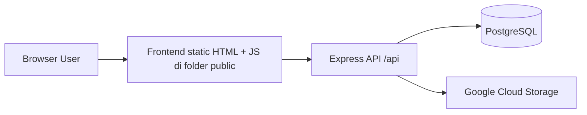
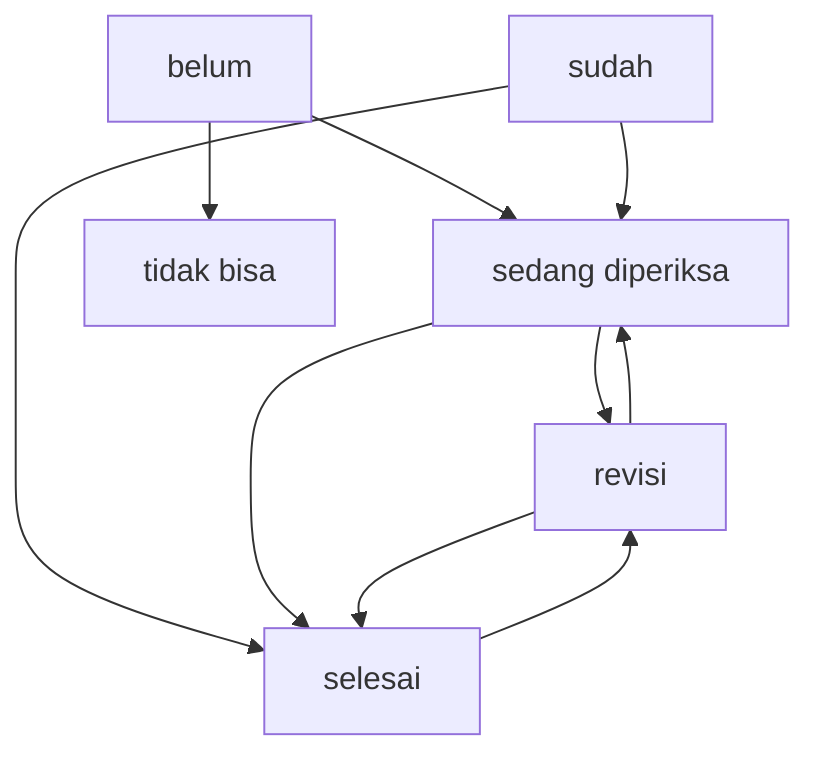

# Panduan Memahami SIPANDU untuk Skripsi dan Sidang

## 1. Gambaran Umum

SIPANDU adalah aplikasi web untuk monitoring data ubinan padi. Secara sederhana, sistem ini dipakai untuk:

- mencatat rencana ubinan,
- mengisi hasil ubinan di lapangan,
- mengunggah bukti foto,
- memeriksa data oleh atasan,
- mengirim revisi bila ada kesalahan,
- menyetujui data akhir,
- mengekspor data ke Excel.

Arsitektur aplikasi ini memakai backend Node.js + Express, database PostgreSQL, frontend static HTML, dan penyimpanan gambar di Google Cloud Storage.

Kalimat singkat yang aman dipakai saat presentasi:

> SIPANDU adalah sistem informasi monitoring ubinan padi berbasis web yang membantu alur kerja petugas lapangan, pemeriksa, dan supervisor mulai dari perencanaan, input hasil ubinan, verifikasi, revisi, sampai rekapitulasi data.

## 2. Teknologi yang Dipakai

- Backend: Express.js
- Database: PostgreSQL
- Frontend: HTML, Bootstrap, JavaScript vanilla
- Authentication: JWT
- Password hashing: bcrypt
- Upload dan optimasi gambar: formidable, sharp
- Export laporan: xlsx
- Penyimpanan file: Google Cloud Storage
- Deployment target: Vercel/serverless-compatible Express app

Makna teknisnya:

- Express menangani request API.
- PostgreSQL menyimpan data master, user, dan data ubinan.
- Frontend tidak memakai framework SPA seperti React, tetapi memakai halaman HTML terpisah.
- JWT dipakai agar setiap request API tahu siapa user yang sedang login.
- Google Cloud Storage dipakai supaya foto tidak disimpan permanen di server lokal.

## 3. Cara Membaca Proyek Ini

Kalau Anda ingin menjelaskan struktur kode dengan mudah, gunakan urutan ini:

1. `index.js` sebagai pintu masuk aplikasi.
2. `routes/` untuk daftar endpoint API.
3. `controllers/` untuk logika bisnis.
4. `config/database.js` untuk koneksi PostgreSQL.
5. `middleware/auth.js` untuk validasi token.
6. `public/` untuk tampilan frontend.

Alur bacanya seperti ini:

Frontend HTML/JS -> request ke `/api/...` -> route Express -> controller -> query ke PostgreSQL atau upload file ke GCS -> response JSON -> frontend menampilkan hasil.

## 4. Arsitektur Sistem

### 4.1 Arsitektur tingkat tinggi

### 4.2 Arsitektur folder

- `index.js`: inisialisasi server Express.
- `routes/`: pemetaan URL API.
- `controllers/`: logika utama aplikasi.
- `config/`: koneksi database dan Google Cloud Storage.
- `middleware/`: validasi token.
- `public/`: semua halaman HTML untuk login, PCL, PML, dan supervisor.
- `schema_postgres.sql`: struktur tabel database.
- `data_postgres.sql`: data awal database.

## 5. Entry Point Aplikasi

File pertama yang perlu dipahami adalah `index.js`.

Fungsi utamanya:

- mengaktifkan CORS,
- melayani file statis dari folder `public`,
- membaca body JSON,
- mencatat log request saat development,
- memasang semua route API di prefix `/api`,
- menyediakan endpoint `/health`,
- menampilkan `public/index.html` saat URL root `/` dibuka.

Artinya, saat browser membuka aplikasi:

- halaman login diambil dari folder `public`,
- setelah itu JavaScript di halaman akan memanggil endpoint backend di `/api/...`.

## 6. Konsep MVC yang Dipakai

Proyek ini mengikuti pola yang mirip MVC walaupun tidak memakai folder `models` secara penuh.

- Model: direpresentasikan oleh tabel PostgreSQL dan query SQL.
- View: halaman HTML di folder `public/`.
- Controller: file di folder `controllers/`.

Jadi kalau dosen bertanya, Anda bisa menjawab:

> Pola yang dipakai adalah MVC sederhana. View ada di frontend HTML, controller ada di backend Express, dan model direpresentasikan oleh struktur tabel serta query SQL di PostgreSQL.

## 7. Peran Pengguna dalam Sistem

Ada tiga role utama:

### 7.1 PCL

Tugas PCL:

- login ke sistem,
- membuat rencana data ubinan,
- mengisi hasil monitoring lapangan,
- mengunggah foto bukti,
- memperbaiki data jika mendapat revisi.

Halaman utama PCL:

- `public/form-user/dashboard_user.html`
- `public/form-user/tambah_data.html`
- `public/form-user/form_monitoring.html`

### 7.2 PML

Tugas PML:

- melihat data ubinan dari PCL yang berada di bawah pembinaannya,
- memeriksa data,
- mengirim revisi,
- mengekspor data ke Excel,
- mengelola user.

Catatan penting:

- relasi PML dan PCL disimpan pada kolom `users.pml_id`.
- ketika PML mengambil data ubinan, backend memfilter data berdasarkan `u.pml_id = user.id`.

### 7.3 Supervisor

Tugas Supervisor:

- melihat seluruh data ubinan,
- memantau dashboard agregat,
- mengelola akun,
- mengelola segmen,
- melihat monitoring keseluruhan,
- menghapus data bila diperlukan,
- mengekspor data ke Excel.

## 8. Alur Login dan Authentication

### 8.1 Proses login

Alurnya:

1. User mengisi username dan password di `public/index.html`.
2. Frontend mengirim `POST /api/auth/login`.
3. `controllers/authController.js` memeriksa user di tabel `users`.
4. Password diverifikasi dengan bcrypt.
5. Jika valid, backend membuat token JWT.
6. Frontend menyimpan `sipandu_user` dan `sipandu_token` di `localStorage`.
7. User diarahkan ke halaman sesuai role.

Redirect berdasarkan role:

- `pcl` -> dashboard PCL
- `pml` -> dashboard PML
- `supervisor` -> dashboard supervisor

### 8.2 Mengapa JWT dipakai

JWT dipakai agar backend bisa mengenali user pada setiap request tanpa menyimpan session di server.

Isi token minimal:

- `id`
- `username`
- `role`
- `pml_id`

### 8.3 Validasi otorisasi

Validasi dilakukan di dua sisi:

- frontend memeriksa role dari data user di `localStorage`,
- backend memeriksa token JWT sebelum memberi akses data sensitif.

Saat sidang, Anda bisa menyampaikan bahwa validasi frontend membantu pengalaman pengguna, tetapi sumber kebenaran tetap backend.

## 9. Database dan Fungsi Tiap Tabel

Database utamanya memiliki tabel berikut.

### 9.1 `kecamatan`

Menyimpan daftar kecamatan.

Kolom penting:

- `id`
- `nama_kecamatan`

### 9.2 `desa`

Menyimpan daftar desa yang terkait dengan kecamatan.

Kolom penting:

- `id`
- `id_kecamatan`
- `nama_desa`

Relasi:

- satu kecamatan memiliki banyak desa.

### 9.3 `users`

Menyimpan akun pengguna sistem.

Kolom penting:

- `username`
- `password`
- `nama_lengkap`
- `role`
- `pml_id`

Makna `pml_id`:

- jika user berperan sebagai PCL, `pml_id` menunjukkan PML pembinanya.

### 9.4 `segmen`

Menyimpan daftar nomor segmen yang digunakan saat membuat rencana ubinan.

Kolom penting:

- `id`
- `nomor_segmen`

### 9.5 `monitoring_data_panen`

Ini tabel paling penting karena menyimpan data ubinan.

Kolom penting:

- identitas: `nama_petani`, `desa`, `kecamatan`
- waktu: `tanggal_panen`, `subround`
- lokasi: `nomor_segmen`, `nomor_sub_segmen`
- file bukti: lima kolom `foto_...`
- hasil hitung: `berat_plot`, `gkp`, `gkg`, `ku`
- status proses: `status`
- relasi petugas: `user_id`
- audit revisi: `note_revisi`, `revised_at`, `revised_by`

Relasi penting:

- satu user PCL dapat memiliki banyak data ubinan.

## 10. Rumus Perhitungan Ubinan

Di backend dan frontend ada perhitungan turunan dari `berat_plot`.

Rumus yang dipakai:

$$
GKP = \frac{berat\_plot / 100}{6.25 / 10000}
$$

$$
GKG = GKP \times 0.8602
$$

$$
KU = GKG \times 0.6274
$$

Makna sederhananya:

- `berat_plot` adalah input dasar dari hasil ubinan.
- `GKP`, `GKG`, dan `KU` adalah nilai turunan yang dihitung otomatis.

Saat presentasi, Anda tidak perlu terlalu teknis. Cukup sampaikan bahwa sistem mengotomatiskan konversi hasil ubinan dari berat plot menjadi indikator produksi agar proses perhitungan lebih konsisten.

## 11. Alur Bisnis Ubinan dari Awal Sampai Akhir

Ini bagian terpenting untuk dipahami.

### 11.1 Tahap 1: PCL membuat rencana ubinan

Halaman: `public/form-user/tambah_data.html`

PCL mengisi:

- nama petani,
- kecamatan,
- desa,
- subround,
- tanggal panen,
- nomor segmen,
- nomor sub segmen,
- status awal.

Lalu frontend mengirim `POST /api/ubinan`.

Backend di `controllers/ubinan/index.js` kemudian:

- memvalidasi field wajib,
- menyimpan data ke tabel `monitoring_data_panen`,
- menyimpan `user_id` sesuai user login,
- mengisi status default atau status yang dipilih.

### 11.2 Tahap 2: PCL mengisi form monitoring

Halaman: `public/form-user/form_monitoring.html`

Saat halaman dibuka:

- frontend memanggil `GET /api/ubinan/:id`,
- data lama ditampilkan,
- beberapa field dibuat read-only,
- PCL mengisi `berat_plot` dan foto-foto pendukung.

Saat submit, frontend menjalankan dua proses:

1. `PUT /api/ubinan/:id`
2. `POST /api/ubinan/:id/upload`

Kenapa dua tahap?

- tahap pertama memperbarui data numerik dan status,
- tahap kedua khusus untuk upload file gambar.

### 11.3 Tahap 3: Kompresi dan upload foto

Sebelum upload:

- frontend mengompresi gambar di browser,
- backend tetap melakukan resize dan kompresi lagi memakai `sharp`.

Tujuannya:

- mengurangi ukuran file,
- mempercepat upload,
- menstandarkan format gambar,
- menghemat storage.

File yang diunggah:

- foto penyampaian uang,
- foto KTP petani,
- foto timbangan ubinan,
- foto proses ubinan,
- foto plot setelah panen.

Setelah itu backend:

- mengunggah file ke Google Cloud Storage,
- menyimpan URL file di database,
- menghapus file lama jika ada revisi upload.

### 11.4 Tahap 4: Pemeriksaan oleh PML atau Supervisor

PML dan Supervisor melihat data ubinan melalui dashboard masing-masing.

Mereka dapat:

- melihat daftar data,
- membuka detail,
- melihat status,
- memeriksa bukti foto,
- memberi revisi,
- menyetujui data.

### 11.5 Tahap 5: Revisi

Jika ada kesalahan, PML atau Supervisor memanggil endpoint:

- `POST /api/ubinan/:id/revisi`

Backend akan:

- menyimpan `note_revisi`,
- mengubah status menjadi `revisi`,
- menyimpan waktu revisi.

Di dashboard PCL, catatan revisi akan muncul sehingga PCL tahu data apa yang harus diperbaiki.

### 11.6 Tahap 6: Finalisasi dan export

Jika data dianggap benar:

- status diubah menjadi `selesai`,
- data bisa diekspor ke Excel oleh PML atau Supervisor melalui `GET /api/ubinan/export`.

## 12. State Machine Status Ubinan

Status yang dipakai sistem:

- `belum`
- `sudah`
- `sedang diperiksa`
- `revisi`
- `selesai`
- `tidak bisa`

Transisi valid di backend:

- `belum -> sedang diperiksa, tidak bisa`
- `sedang diperiksa -> selesai, revisi`
- `revisi -> selesai, sedang diperiksa`
- `selesai -> revisi`
- `sudah -> sedang diperiksa, selesai`
- `tidak bisa -> terminal`

Diagram sederhananya:

Nilai akademis dari bagian ini:

- sistem tidak hanya menyimpan data,
- sistem juga mengendalikan alur kerja melalui aturan status.

Ini sangat baik untuk dibahas saat sidang karena menunjukkan bahwa aplikasi Anda memiliki kontrol proses, bukan sekadar form input biasa.

## 13. Hak Akses Data per Role

### 13.1 PCL

- hanya melihat data miliknya sendiri,
- hanya bisa mengisi atau memperbaiki data yang relevan,
- tidak bisa export,
- tidak bisa menghapus data.

### 13.2 PML

- melihat data PCL di bawah pembinaannya,
- bisa revisi,
- bisa export,
- bisa mengelola user.

### 13.3 Supervisor

- melihat semua data,
- bisa mengelola akun dan segmen,
- bisa menghapus data ubinan,
- bisa export semua data.

## 14. Endpoint Penting yang Perlu Diingat

### Authentication

- `POST /api/auth/login`
- `POST /api/auth/logout`
- `POST /api/auth/change-password`

### Master data

- `GET /api/kecamatan`
- `GET /api/desa/:id`
- `GET /api/segmen`
- `POST /api/segmen`
- `POST /api/segmen/import`

### Ubinan

- `GET /api/ubinan`
- `POST /api/ubinan`
- `GET /api/ubinan/:id`
- `PUT /api/ubinan/:id`
- `DELETE /api/ubinan/:id`
- `POST /api/ubinan/:id/upload`
- `POST /api/ubinan/:id/revisi`
- `GET /api/ubinan/export`

### Users

- `GET /api/users`
- `POST /api/users`
- `GET /api/users/:id`
- `PUT /api/users/:id`
- `DELETE /api/users/:id`

## 15. Halaman Frontend dan Fungsinya

### Halaman umum

- `public/index.html`: halaman login.
- `public/auth/ganti_password.html`: ganti password.

### Halaman PCL

- `public/form-user/dashboard_user.html`: daftar data ubinan milik PCL.
- `public/form-user/tambah_data.html`: input rencana ubinan.
- `public/form-user/form_monitoring.html`: input hasil monitoring dan upload bukti.

### Halaman PML

- `public/pml/index.html`: ringkasan data ubinan dan statistik.
- `public/pml/detail_ubinan.html`: detail data ubinan dan proses pemeriksaan.

### Halaman Supervisor

- `public/supervisor/index.html`: dashboard utama supervisor.
- `public/supervisor/monitoring.html`: monitoring data tertentu.
- `public/supervisor/monitoring_panen.html`: daftar data ubinan keseluruhan.
- `public/supervisor/detail_ubinan.html`: detail data ubinan.
- `public/supervisor/monitoring_akun.html`: daftar akun.
- `public/supervisor/tambah_user.html`: tambah akun baru.
- `public/supervisor/edit_akun.html`: edit akun.
- `public/supervisor/manage_segmen.html`: kelola segmen.

## 16. Alur Request yang Baik untuk Dijelaskan ke Dosen

Gunakan contoh ini saat menjelaskan kode.

Contoh: PCL menambah rencana ubinan.

1. User membuka halaman `tambah_data.html`.
2. JavaScript memanggil `GET /api/kecamatan`, `GET /api/desa/:id`, dan `GET /api/segmen` untuk mengisi dropdown.
3. Saat form disubmit, frontend mengirim `POST /api/ubinan`.
4. Route `routes/ubinan.js` meneruskan request ke controller `controllers/ubinan/index.js`.
5. Controller memvalidasi token JWT dan isi form.
6. Controller menjalankan query `INSERT INTO monitoring_data_panen`.
7. Backend mengembalikan JSON sukses.
8. Frontend menampilkan pesan berhasil dan redirect ke dashboard.

Kalau Anda bisa menjelaskan satu flow ini dengan lancar, biasanya dosen akan melihat bahwa Anda benar-benar memahami aplikasi.

## 17. Mengapa Desain Ini Layak Secara Teknis

Poin yang bisa Anda pakai untuk pembelaan teknis:

- pemisahan frontend dan backend membuat kode lebih terstruktur,
- JWT membuat autentikasi stateless dan mudah dipakai pada API,
- PostgreSQL cocok untuk data relasional seperti user, desa, kecamatan, dan ubinan,
- Google Cloud Storage cocok untuk penyimpanan bukti gambar skala produksi,
- status workflow membuat proses verifikasi lebih terkendali,
- export Excel memudahkan pelaporan operasional.

## 18. Kelebihan Sistem

- mendukung multi-role user,
- ada kontrol akses berdasarkan role,
- ada alur revisi dan approval,
- mendukung upload bukti foto,
- mendukung export data,
- ada validasi status workflow,
- struktur proyek relatif mudah dipelajari.

## 19. Keterbatasan Sistem yang Bisa Diakui Saat Sidang

Bagian ini penting. Jangan mengklaim sistem sempurna.

Keterbatasan yang aman dan jujur untuk disebutkan:

- frontend masih berbasis multi-page HTML, belum SPA modern,
- query SQL masih ditulis langsung di controller, belum dipisah ke layer repository/model yang lebih rapi,
- validasi backend masih manual per controller,
- audit log perubahan belum terlalu lengkap,
- pengujian otomatis belum terlihat disiapkan di proyek ini.

Kalau dosen bertanya pengembangan lanjutan, jawab saja bahwa sistem bisa ditingkatkan dengan refactor arsitektur service layer, unit test, dan dashboard analitik yang lebih kaya.

## 20. Narasi Presentasi 3-5 Menit

Berikut contoh narasi singkat.

> SIPANDU adalah sistem informasi monitoring ubinan padi berbasis web yang saya buat untuk membantu proses pencatatan dan verifikasi data ubinan. Sistem ini memiliki tiga peran utama, yaitu PCL sebagai petugas input lapangan, PML sebagai pemeriksa, dan Supervisor sebagai pengawas keseluruhan. Secara teknis, sistem dibangun menggunakan Node.js dan Express pada backend, PostgreSQL sebagai basis data, serta HTML, Bootstrap, dan JavaScript pada frontend. Alur utamanya dimulai dari PCL membuat rencana ubinan, kemudian mengisi hasil monitoring dan mengunggah bukti foto. Setelah itu data diperiksa oleh PML atau Supervisor. Jika ada kesalahan, sistem menyediakan mekanisme revisi. Jika data sudah benar, status diubah menjadi selesai dan dapat diekspor ke Excel. Dengan demikian, sistem ini tidak hanya berfungsi sebagai media input data, tetapi juga sebagai workflow monitoring yang memiliki kontrol status dan pembagian hak akses.

## 21. Skenario Demo yang Aman untuk Sidang

Urutan demo yang disarankan:

1. Login sebagai PCL.
2. Tunjukkan dashboard PCL.
3. Tambah satu rencana ubinan.
4. Buka form monitoring dan isi berat plot.
5. Upload bukti foto.
6. Tunjukkan bahwa status berubah menjadi `sedang diperiksa`.
7. Login sebagai PML atau Supervisor.
8. Buka data yang tadi dibuat.
9. Tunjukkan detail dan lakukan revisi atau approval.
10. Jika perlu, tunjukkan export Excel.

Tujuan urutan ini:

- menunjukkan alur end-to-end,
- memperlihatkan multi-role access,
- memperlihatkan nilai praktis sistem.

## 22. Pertanyaan yang Mungkin Muncul Saat Sidang

### Apa alasan memakai PostgreSQL?

Karena data bersifat relasional, misalnya relasi user, desa, kecamatan, dan data ubinan. PostgreSQL kuat untuk query terstruktur dan menjaga integritas data.

### Kenapa memakai JWT?

Karena sistem berbasis API dan perlu autentikasi stateless yang cocok untuk deployment serverless.

### Mengapa file disimpan di Google Cloud Storage?

Karena deployment seperti Vercel tidak cocok untuk penyimpanan file lokal permanen. Cloud storage lebih aman dan skalabel.

### Apa manfaat status workflow?

Status workflow memastikan data bergerak sesuai proses bisnis, misalnya dari input ke pemeriksaan, revisi, lalu finalisasi.

### Apa kontribusi sistem ini dibanding input manual biasa?

Sistem ini mengurangi pencatatan yang tersebar, mempercepat verifikasi, menyediakan bukti foto, dan memudahkan rekap laporan.

### Apa pengembangan berikutnya?

Menambahkan notifikasi, audit log, dashboard analitik, dan pengujian otomatis.

## 23. Cara Cepat Menghafal Kode Proyek Ini

Jika Anda tidak sempat membaca semua file, hafalkan inti berikut:

- `index.js` adalah pintu masuk backend.
- `routes/` hanya memetakan endpoint.
- `controllers/ubinan/` adalah inti logika aplikasi.
- `authController.js` menangani login dan ganti password.
- `userController.js` menangani manajemen akun.
- `public/form-user/` adalah area PCL.
- `public/pml/` adalah area PML.
- `public/supervisor/` adalah area supervisor.
- tabel terpenting adalah `monitoring_data_panen`.
- konsep terpenting adalah role-based access dan workflow status.

## 24. Ringkasan Satu Paragraf

Jika Anda harus menjelaskan proyek ini dalam satu paragraf, gunakan versi ini:

> SIPANDU adalah aplikasi monitoring ubinan padi berbasis web dengan arsitektur frontend static HTML dan backend Express.js yang terhubung ke PostgreSQL. Sistem ini mendukung tiga role pengguna, yaitu PCL, PML, dan Supervisor. Data ubinan disimpan pada tabel monitoring, dilengkapi dengan hasil perhitungan otomatis dan bukti foto yang diunggah ke Google Cloud Storage. Proses bisnis dalam sistem dikendalikan oleh status workflow seperti sedang diperiksa, revisi, dan selesai, sehingga aplikasi tidak hanya melakukan input data, tetapi juga mendukung verifikasi dan pengawasan secara terstruktur.

## 25. Saran Belajar Sebelum Sidang

Fokus pelajari empat hal ini dulu:

1. flow login dan JWT,
2. flow tambah data ubinan,
3. flow revisi dan approval,
4. struktur tabel `monitoring_data_panen`.

Kalau empat hal ini sudah Anda kuasai, Anda biasanya sudah cukup kuat untuk menjawab sebagian besar pertanyaan sidang tentang aplikasi.